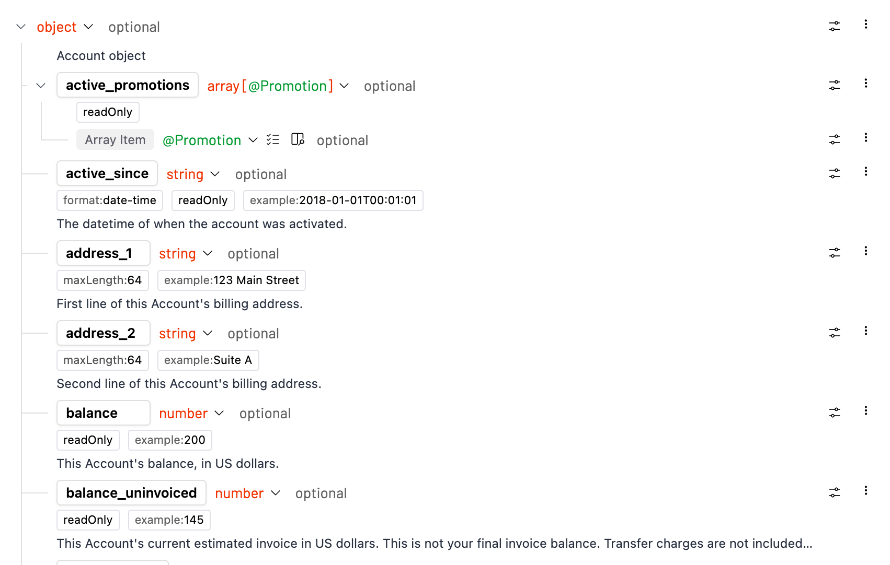

# handtree

[](https://badge.fury.io/js/handtree)
[](https://www.npmjs.com/package/handtree)
[](https://bundlephobia.com/package/handtree)
[](https://www.typescriptlang.org/)
[](https://opensource.org/licenses/MIT)

A React tree component for **hand-crafted** hierarchical interfaces. Unlike data-driven tree libraries, handtree lets you compose tree structures manually with full control over styling, behavior, and layout.

**[📖 Live Examples & Documentation →](https://naivefun.github.io/handtree/)**

## Why handtree?

Most tree components are data-driven - they work well when you can normalize your data into a homogeneous structure like `{id, children}`. But many real-world scenarios resist this normalization:

```tsx
// Hard to normalize - different node types, mixed content
const jsonSchema = {
  User: { type: 'object', required: true, properties: {
    id: { type: 'string', validation: /\d+/ },
    profile: { type: 'object', properties: {
      name: { type: 'string', maxLength: 50 },
      settings: { type: 'array', items: 'string' }
    }}
  }}
}
```

handtree is perfect when you need to:
1. **Handle complex nested data structures** that don't fit a uniform schema
2. **Different node content and behaviors** for different node types (objects vs arrays vs primitives, each with unique styling and interactions)

Instead of forcing your data into a generic tree format, handtree lets you craft each node type exactly as it should appear and behave.

<a href="./assets/schema-editor.png">
  
</a>

*Real-world usage: OpenAPI schema editor where each field type (object, array, string, number) has unique rendering, metadata, and interactions. Note the rich details below each field (descriptions, examples, constraints) - this level of content is difficult and often not worth normalizing into a generic tree structure.*

## Used in Production

handtree powers the hierarchical interfaces in [reapi.com](https://reapi.com) - an OpenAPI schema editor and no-code testing platform. It handles complex nested schemas with hundreds of nodes while maintaining smooth performance and user experience.

## Installation

```bash
npm install handtree
# or
pnpm add handtree
# or  
yarn add handtree
```

## How it works

The core pattern is using `TreeNode` as a **visual renderer** inside your own data-type-oriented components. You don't use `TreeNode` directly - instead, you create components that understand your specific data structure and use `TreeNode` to render the tree visualization.

```tsx
// Your data-oriented component
function JsonSchemaNode({ schema, level }) {
  return (
    <TreeNode
      level={level}
      expandable={schema.type === 'object'}
      title={<SchemaTitle data={schema} />}
      details={<SchemaDetails data={schema} />}
    >
      {schema.properties?.map(prop => 
        <JsonSchemaNode key={prop.name} schema={prop} level={level + 1} />
      )}
    </TreeNode>
  )
}

// Your custom title component
function SchemaTitle({ data }) {
  return (
    <span className="flex items-center gap-2">
      <span className="text-blue-600 font-bold">{data.name}</span>
      <span className="text-gray-500">:</span>
      <span style={{ color: getTypeColor(data.type) }}>{data.type}</span>
      {data.required && <span className="text-xs bg-red-100 text-red-800 px-1 rounded">required</span>}
    </span>
  )
}

// Your custom details component  
function SchemaDetails({ data }) {
  return data.description ? (
    <div className="text-xs text-gray-600 italic py-1">
      {data.description}
      {data.validation && <code className="ml-2 bg-gray-100 px-1">{data.validation.toString()}</code>}
    </div>
  ) : null
}

// Usage
<TreeContext.Provider value={{ indent: 24, ancestorLastTrail: [], classNames: {} }}>
  <JsonSchemaNode schema={mySchema} level={0} />
</TreeContext.Provider>
```

This way, `JsonSchemaNode` handles the business logic (what's expandable, how to render titles), while `TreeNode` handles the tree visualization (lines, indentation, expand/collapse UI).

## Beyond Title: Rich Details Support

Unlike traditional tree components that only show a title per node, handtree supports rich **details** content below each title. This is perfect for showing:

- **Documentation** (API descriptions, schema details)
- **Metadata** (file sizes, timestamps, validation rules)  
- **Status indicators** (health checks, build results)
- **Secondary actions** (buttons, links, badges)

The details section maintains proper tree indentation and connecting lines, creating a clean hierarchical layout even with complex content.

## API Reference

### TreeContext

Provides configuration for the entire tree.

```tsx
interface ITreeContext {
  indent: number                    // Indentation per level (px)
  ancestorLastTrail: boolean[]      // Internal: tracks line drawing
  classNames: Record<string, string> // Custom CSS classes
}
```

### TreeNode

The visual renderer component. This handles tree UI concerns (indentation, connecting lines, expand/collapse icons) while you handle the data concerns in your wrapper component.

```tsx
interface TreeNodeProps {
  level: number                     // Nesting level (0 = root)
  lastNode?: boolean               // Is this the last sibling?
  title: React.ReactNode           // Node content (your custom JSX)
  details?: React.ReactNode        // Additional details below title
  children?: React.ReactNode       // Child nodes (usually more of your wrapper components)
  expandable?: boolean             // Can this node be expanded?
  expanded?: boolean               // Is this node expanded?
  onToggleExpanded?: () => void    // Expand/collapse handler
}
```

**Key responsibilities:**
- **Visual structure**: Draws connecting lines, handles indentation
- **Expand/collapse UI**: Shows icons and handles click interactions
- **Layout**: Positions title, details, and children properly

**Your wrapper component handles:**
- **Data interpretation**: What should be expandable? What's the title?
- **Business logic**: State management, event handling
- **Content rendering**: Custom styling, icons, badges, etc.

## Examples

Explore interactive examples and see handtree in action:

**[📖 Live Examples & Documentation →](https://naivefun.github.io/handtree/)**

### Available Examples

- **Basic Tree View** - Simple hierarchical structure showing the core TreeNode API
- **Interactive JSON Schema Explorer** - Complex nested data with custom styling, expand/collapse state management, and rich details content. Perfect example of handling heterogeneous data structures that resist normalization.
- **Minimal Example** - Lightweight implementation showing the essential patterns

## Customizing Styles

handtree uses prefixed CSS classes that you can easily override:

```css
/* Customize tree lines color */
.handtree-root {
  --outline-color: #0066cc;
}

/* Style the expand/collapse icons */
.handtree-head {
  color: #666;
}
.handtree-head:hover {
  color: #0066cc;
}

/* Customize spacing */
.handtree-root {
  --indent-width: 32px;
  --head-width: 30px;
}
```

**Available CSS classes:**
- `.handtree-root` - Root container
- `.handtree-node` - Individual node wrapper  
- `.handtree-head` - Expand/collapse area
- `.handtree-title` - Title content area
- `.handtree-details` - Details content area
- `.handtree-content` - Main content wrapper
- `.handtree-indent` - Indentation guides

**CSS Variables:**
- `--outline-color` - Tree connecting lines color
- `--indent-width` - Indentation per level  
- `--head-width` - Width of expand/collapse area

## Development

```bash
# Install dependencies  
pnpm install

# Start development with hot reload
pnpm dev

# View component demos
pnpm ladle:serve

# Build for production
pnpm build
```

## Contributing

We welcome contributions! Please see our contributing guidelines for details.

## License

MIT © [Your Name]